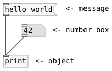

  

    Table of contents
  

  {: .text-delta }
1. TOC
{:toc}

# What is Plugdata

From the [Plugdata website](https://plugdata.org/):

{: .note }
> A visual programming environment for audio experimentation, prototyping and education.
> Plugdata is a free/open-source visual programming environment based on pure-data. It is available for a wide range of operating systems, and can be used both as a standalone app, or as a VST3, LV2, CLAP or AU plugin.
>
> Plugdata allows you to create and manipulate audio systems using visual elements, rather than writing code. Think of it as building with virtual blocks – simply connect them together to design your unique audio setups. It's a user-friendly and intuitive way to experiment with audio and programming.

## About Pure Data and visual / modular programming

{: .attention }
> 💡 If you know what Plugdata is and how it’s different from Pure Data > skip this part.
>
>Read this if you don’t know these terms: Pure Data, Plugdata, Pd, flavours, modular, visual programming. I've written a short intro on the concept.

### Pure Data

Pure Data goes back many years and was made as a tool to help artists create (interactive) sound. It uses a visual blocks structure, comparable to e.g. Scratch, a tool used to teach (kids) programming, you link pieces of code together where each block has a specific function in the whole.

### Pure Data - “flavours”

Plugdata is a *version* or *flavour* of the og Pure Data.

{: .note }
> **Pure Data** (or just "Pd") is an open source visual programming language for multimedia. Pure Data is developed by Miller Puckette since 1996 and you can find it on [his official website](https://msp.ucsd.edu/) along with the official documentation and other related resources. This is the official "Pd" or "main distribution" and it is also known as "Pd Vanilla", but there are other forks or "flavours".
>
> source: intro on puredata.info 

## Modular approach from Hardware to software

{: .new }
> The common idea is using cables to connect pieces that interact.

You could go far with this analogy as **all things are a whole of parts**, yet for sake of this document let’s just keep the connecting of different parts as the main concept.

### Pedalboards

If you are guitar player or seen one then you've certainly seen them using pedals to add effects. These pedals are our objects in Plugdata, sometimes our patches are inside the pedal adding extra functions, **tweaking circuits**, other times we just **plug the pedal in without knowing it's inner magic**.

Pedalboards are a big thing in the world of guitarists, but have also found it's way into people playing DAW-less setups.

Modep is software that alow you to build virtual pedalboards. Letting you connect a plethora of midi an sound fx in various ways.

### Eurorack

Coming from the music world you might be familiar with modular Eurorack synths. The rabbit hole or cable spaghetti maker, build your own dreamsynth it's often called.

Maybe you’ve even used synths or kits in a eurorack system that use the Daisy microcontroller.

### Virtual eurorack

Or maybe you’ve seen the virtual eurorack systems like VCV rack, there's also others like Cherry Audio Voltage Modular and more ...

<iframe width="560" height="315" src="https://www.youtube.com/embed/NPErDUlwSlg?si=vqqYQokqqDcMECXk" title="YouTube video player" frameborder="0" allow="accelerometer; autoplay; clipboard-write; encrypted-media; gyroscope; picture-in-picture; web-share" allowfullscreen></iframe>

## The modular approach in other software

There are many tools out there that use this approach to programming or building electronic stuff, be it analog or digital.

In 3D software like e.g. Blender they’re called nodes.

Audiovisual programs like Touchdesigner and [Cables.gl](http://Cables.gl) are also both examples of tools that heavily rely on the approach of connecting blocks with virtual cables.

Blender geometry nodes:

Cables.gl:

Maybe you've seen the DAW Bitwig and how the grid can be used to build your own effect or synth.

### *Modular* coding or patching

Seeing you’ve stumbled upon this page, you might already be familiar or knowledgeable on this concept of using code and libraries.

It's often a way to prevent us from reinventing the wheel. But also a huge help for starters as we don't need every piece of complex code, we can just reference a certain function that's easily accessible for us.

In Plugdata we'll use a block (object), with the word `myknob`, and through the use of several other files, when we save or rather compile to the Daisy microcontroller the software will use these behind the curtains info to write the correct code.

This gives two advantages:
- it's easy to use the functions it provides
- we keep our own code / patch clean and tidy making it easier to write and read

E.g. case in point of using Daisy seed and a knob connected to one of the pins:
  1. We put a few lines in a separate file that describes our board and how it's connected (custom json)
  2. The necessary code to talk to the sensor, the code to read the sensor, and the implementation into Plugdata is all being done through various tools, libraries.
  3. As an end user we can just put a block that says “knob1”, etc.
 
   Plugdata can be seen as a similar thing of this modular programming approach you write names of functions or tools; e.g. an oscillator, you don’t know how the oscillator is itself in turn made of smaller components. You just put a block that says give me an oscillator with the frequency 440.

{: .new }
> We don’t need to know how to make paint, brushes and a canvas to be a proficient painter. We use tools all the time that we couldn't build ourselves.