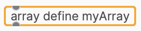

{: .new }
>On this page:
>- Install plugdata and the toolchain
>- describe your custom Daisy setup and create a custom json
>- compile using Heavy

# [](#compiling_workflow)Compiling workflow

To get up and running you need to understand the basic workflow for getting your Patches from Plugdata compiled onto the Daisy seed microcontroler.

{: .attention }
> In short the workflow to go from patch to Daisy:
> 1. Make a **compatible** Plugdata patch
> 2. Setup a **custom json** file that describes to which pins our components are connected
> 2. Use the **compile** menu to upload to Daisy.
    - Heavy does the translating.

There are some caveats, things to consider. Daisy isn't your computer, a patch made for one device won't just automagically work on your device. We need to look at some software details and we need to compare the hardware.

{: .highlight }
> 💡 Not all existing patches work as is; they get converted; Many of the fancy visual stuff is useless for Daisy, many patches rely on stuff that isn’t supported, and Daisy also has limited CPU power compared to a computer.

- Patches get converted from pure data to C/C++ code
- The conversion is done by hvcc https://github.com/Wasted-Audio/hvcc
- some pd stuff is not supported, there is a [list with all (un)supported items](https://github.com/Wasted-Audio/hvcc/blob/develop/docs/09.supported_vanilla_objects.md)
- e.g. Plugdata makes a lot of use of the  “else” library but this is not (yet) able to be converted by Heavy 
- plugdata makes it ‘easy’ when you use ‘compiled mode’ by showing a warning what is or isn’t supported

Plugdata makes this whole process of converting your patches to the Daisy very smooth as everything happens from within the software.

A method that was already made for converting regular pure data patches was made available by Electrosmith in the handy tool pd2dsy. This tool allows to take patches made in pd format and convert/upload them.

However Plugdata has a few advantages over doing this manually via pd2dsy:
- Installing the needed toolchain is done for you when opening the compile window
- when using Plugdata in "compile" mode you get instant feedback when something is not compatible by and autocomplete won't show unsupported objects.
- if you've already setup the Arduino ide to program your Daisy you might be surprised how little setup is needed. Plugdata will fetch everything you need as the Toolchain. 
- The arduino serial monitor can be a handy tool to debug or read signals that you send to `print`.

{: .highlight }
> **Using compile mode in Plugdata**, you'll instantly see when you use incompatible objects.
>  - limitting the auto-complete to hvcc compatible objects;
>  - and giving warnings when you use in-compatible ones



<sub>Object error indication when using an unsupported object in Compilation Mode</sub>


<sub>Console error warning when using an unsupported object in Compilation Mode</sub>


# [](#installing-1)Installation instructions

Install Plugdata for your platform via the [Plugdata website](https://plugdata.org).

After completing the installation go to the compile menu via `Menu > Compile`

{: .highlight }
The first time you open the compile window the program will automatically begin downloading the toolchain.

The download might take a while but is a one time event, so once the toolchain has completed the download this window will always open instantly.

# [](custom_json)Telling the patch to which pins our hardware components are connected

In Plugdata you'll be referring to your connected components with an object that looks like this:
> `r my_custom_knob @hv.param`

Typing this into an object in Plugdata will create a block with an outlet that outputs a value from `0 to 1`  (e.g. 0.1 or 0.891)

In the compile window we'll point to a custom json file where we list our hardware setup.


{: .note }
>Note that there are a few other settings that aren't discussed here yet, like 'Patch size' or memory allocations.
>
>When starting leave them at the defaults, more info will be shown in the full examples. 
>
>In the next chapter there's a full example and more elaborate info on setting up this json file.

For now, here's a small example of the content of the json file that's linked to our example  
> `r my_custom_knob @hv.param`

```json
   "components": {
       "my_custom_knob": {
           "component": "AnalogControl",
           "pin": 21
       }
   } 
```

## About the toolchain and compiling

The toolchain is a collection of needed stuff to 'export' your patches into other formats, this could be straight to C++ or in our case it provides everything we need to compile it onto the Daisy seed.

Follow [this link](https://wasted-audio.github.io/hvcc/) to learn more about Heavy 

***

{: .warning }
> Note the following section is a blunt copy taken from Plugdata's documentation and was copied from Github on 26/01/2024

***

# Compilation and Integration with HVCC Compiler

## Overview

**plugdata** provides the additional functionality to compile your patches for various targets. The supported targets include:

- **C++ Code:** Generates C/C++ source code for use in other DSP projects.
- **Electro-Smith Daisy:** Compiles and flashes code onto a Daisy microcontroller board.
- **DPF Audio Plugin:** Creates an audio plugin for use in various plugin hosts.
- **Pd External:** Compiles your patch into a Pure Data external object, optimizing its performance.

WARNING: Ensure that the destination path for exporting code or plugin binaries does not contain any spaces.

## Compiled Mode

In the main plugdata menu, you'll find a toggle box labeled ***Compiled Mode***. This mode checks your patch for compliance with plugdata compilation tools. It uses the [Heavy hvcc compiler](https://wasted-audio.github.io/hvcc/docs/01.introduction.html#what-is-heavy), which is limited to a subset of Pure Data Vanilla objects.

***Compiled Mode*** identifies unsupported objects in your patch, posting a message to the console and providing auto-completion only for compatible objects. 

By downloading the compilation toolchain, the [Heavy hvcc compiler](https://wasted-audio.github.io/hvcc/docs/01.introduction.html#what-is-heavy) maintained by [Wasted Audio](https://wasted.audio/) will be installed, along with additional compilation utilities. hvcc can only generate code for a portion of the objects included with plugdata, which are a subset of the Pure Data Vanilla set of objects.

***Compiled Mode*** indicates if there are objects in your patch that cannot be used in a compiled patch by posting a message to the console, and outlining the object in question. The auto-completion in plugdata will also only provide compatible objects when this mode is activated.


<sub>Object error indication when using an unsupported object in Compilation Mode</sub>


<sub>Console error warning when using an unsupported object in Compilation Mode</sub>


## Compiling in plugdata

Selecting `Compile...` opens a window with compilation options for different modes, each with common and mode-specific configurations.

### General Configuration


Common fields in this section include:

- **Patch to export:** Choose the patch you wish to export.
- **Project Name (Optional):** Autofills with the patch's name.
- **Project Copyright (Optional):** Specify under one of the [common source licenses](https://spdx.org/licenses/).

### C++ Code


In C++ Code mode, your plugdata patch is transpiled to generic C/C++ code. Adapt the raw code for specific applications. Learn more in the [official documentation](https://wasted-audio.github.io/hvcc/docs/05.c.html).

### Electro-Smith Daisy


Daisy mode allows running your patch on an embedded hardware device based on an STM32 microcontroller. Options include choosing a target board, export types (Source Code, Binary, Flash), enabling USB MIDI, and configuring patch size.

### DPF Audio Plugin


DPF mode exports self-contained versions of your patch in various formats (VST2, VST3, LV2, CLAP, JACK). Choose export type (Source Code, Binary) and plugin type (Effect, Instrument, Custom). Select plugin formats in the provided list.

### Pd External


Export your patch as a Pd external for optimized performance. Choose export type (Binary or Source Code) and enable copying to the externals path.

Refer to the [official documentation](https://wasted-audio.github.io/hvcc/docs/03.gen.pdext.html) for more details on each export option.

