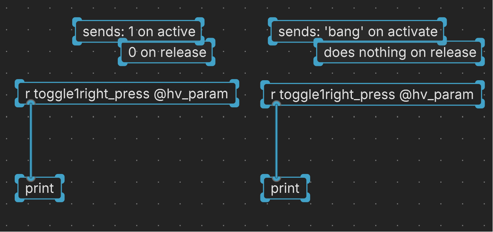
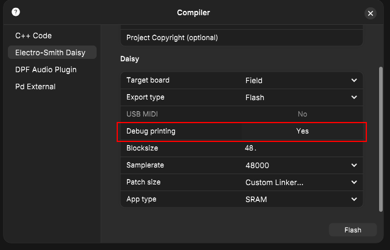
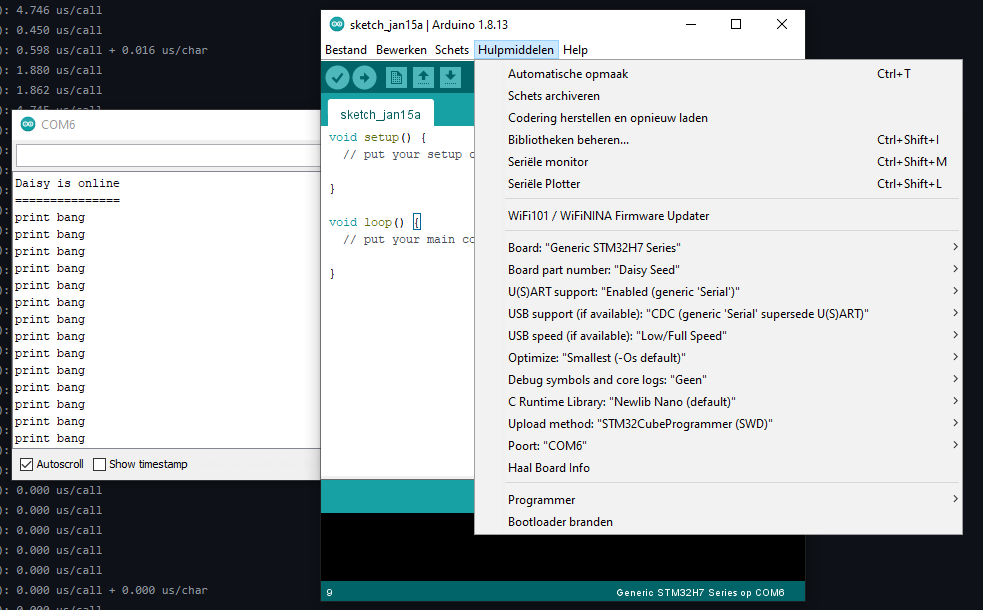

<details open markdown="block">
  <summary>
    Table of contents
  </summary>
  {: .text-delta }
1. TOC
{:toc}
</details>

# About debugging and error solving

## RTFM

We all like to jump in head first, and then when we fall we look up our mistakes.
There is a lot of useful info at the HVCC docs that goes over some of the most important things to consider when debugging.

Read this when getting started, look at the Tips and Tricks section, and the Known Limitations.

## No spaces in your files and paths, no CAPS in custom json names.

The Heavy compiler will output an error when there are spaces in the path or in the file names. This also applies to any subpatches you might use, or if you are exporting/saving your compiled patch to disk. 
>
> {: .warning }
> ***Do not*** use spaces in file names or in the paths
> ***Do not***_ use capital letters in your custom components names

## Daisy has its own ~~blue screen~~ annoying beep of death

It is not uncommon to hear a loud beep when a patch crashes.

Sometimes these crashes happen:
- Patch crashing silently, you might not be sure if didn't upload, didn't start, etc ...
- Crash is immediate and starts the loud beep
- Patch will run for a while, even untouched, then crash seemingly random
- Doing a specific interaction like turning a knob, or turning it very fast

{: .warning}
> **Debugging**
>
> - First step is always to check if you have as much as possible in the ~sig / signal domain.
>
> - break your patch down into smaller pieces to find what is causing the error.
>
> - Use printing (to serial) if your in doubt of what values you're outputting.
>
> - Read the info at HVCC docs for more general info, tips and tricks and known limitations, (un)supported items, etc.: [HVCC getting started](https://wasted-audio.github.io/hvcc/docs/02.getting_started.html)


# Printing to serial instructions

To be able to read messages sent by our components we can send it to print. If you've done this with an Arduino you probably know the function `Serial.print()`.

{: .highlight}
> Sending to Print takes up a bit of additional program memory as well, so don't do this too quickly as you may fill up the print buffer and things can crash.

Steps to follow:
- In Plugdata you connect your component to a print object.
- When compiling you activate the serial debugging via USB
- connect to a serial monitor
  - If you have already setup Arduino you can use it's serial monitor.

## Connect the Print object in Plugdata

Connect the outlet of your component so you can then send messages into the `[print]` object. 



{: .new}
> Though we cannot read the serial output from a connected Daisy in Plugdata, the output of print inside of Plugdata can still be very usefull for learning about your signal flow.
> Connect e.g. a bng button to a print object and in the console window you'll see the message: `print: bang`.

## Compiling with serial debugging

Activate Serial Debugging in the compile window before you compile and upload your patch to the Daisy.



## Using a serial monitor

#### Serial monitor Arduino

If you have setup the Arduino IDE you could use the serial monitor.



#### Serial monitor via system terminal

There are other methods that I'm not familiar with yet. So you'll have to study this or ask around. 👀

One type of command I came across for Linux was `stty`:

```
#!/bin/bash
stty -F /dev/ttyUSB0 115200 -echo -icrnl raw
cat /dev/ttyUSB0 | tee /dev/tty | grep --max-count=1 -F "root@ramfs:"
```

If you know how that works before I test it properly send me a message ;-)

