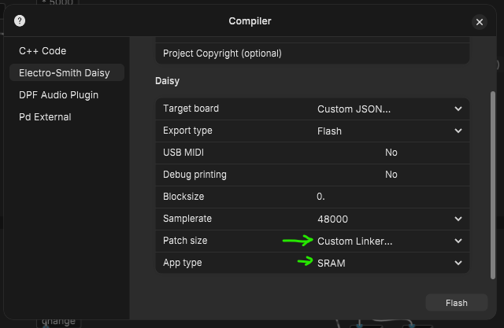

  

    Table of contents
  

  {: .text-delta }
1. TOC
{:toc}

# Memory and CPU - custom linker

The Daisy has a few options for using different types of memory when uploading your compiled patch. You'll come across RAM, SRAM, QSPI, ...
Maybe you'll need some space to to save a sample. It's possible, yet pretty complex if you're new.

{. new}
> When running into memory issues like in the compile window you'll see how much % your patch is using of each memory region. (It's not all the same and not as easy as just using the biggest region.)
>
> Sometimes your patch will compile but crash. e.g. with the annoying whining high tone, we all hate this and there can be many reasons.
>
> **Debugging**
>
> - First step is always to check if you have as much as possible in the ~sig / signal domain.
>
> - break your patch down into smaller pieces to find what is causing the error.
>
> - Use printing (to serial) if your in doubt of what values you're outputting. [see this page](01_install_setup_plugdata\04_serial\serial_debug_print.md)
>

In the compile window in Plugdata you'll see an option under **Patch size** to pick different modes, as of writing this document, there are the Small, Big and Huge options.

- These different modes pick a different way of how your patch get's compiled and uploaded to Daisy's different memory options. 
- Simply put: Small is the internal memory, Big goes to SRAM, Huge to QSPI. 
- However it's more complicated than just using the bigger option as each has it's own ways and speeds of working. 

{: .attention}
> You can specify whether you'd like to optimize your project's RAM usage for speed or size. The Daisy's internal SRAM has a fast access time, but it can be quite limited at 512kB (or even less if you're using the bootloader!). The external SDRAM (note the D), while it can be slower to access, affords a hefty 64MB of space. Currently, only the heap is placed in SDRAM if size is selected (meaning all dynamic allocations happen in SDRAM), but that's the best use-case for it anyway, since the largest program you could squeeze onto the Daisy would only be around 512kB.
>
>taken from README at [GitHub - electro-smith/pd2dsy: ](https://github.com/electro-smith/pd2dsy/tree/master?tab=readme-ov-file#--ram)

## Which one should you pick?

The debate on the naming and approach to this is still being debated/thought about, so might/will change.

Again, while complex and there not being a single answer, we'll follow this approach:

For basic patches like on this site the **Small** option will suffice.

If you find your patch doesn't fit into Small, then the **Big** option is a good choice, as this will help you get your larger and perhaps more complex patches to fit into the Daisy. Of course, again, when your patches start using things like arrays or delays and you need specific functions this might all vary.

## Memory allocations and regions for e.g. using delayread

Specifically I started out with wanting to experiment with **delays**, and the `[delread]` object quickly fills up the memory of the Daisy when you want longer delays than 1 or 2 seconds. And I wanted a stereo delay, so that's double the amount ...

That’s why I ended up using a custom linker to make use of SDRAM. Delays make use of this larger available memory. Though I’ve yet to learn more about how memory allocation actually flows, this seems like a good thing to know. And reading up on the links below

## More info at these links:

[GitHub - electro-smith/pd2dsy: Utility for converting Pure Data (Vanilla) patches to Daisy projects.](https://github.com/electro-smith/pd2dsy/tree/master?tab=readme-ov-file#--ram)

And this site 

[libDaisy: Getting Started - External SDRAM](https://electro-smith.github.io/libDaisy/md_doc_2md_2__a6___getting-_started-_external-_s_d_r_a_m.html)

To be able to use this larger memory I've been using the custom linker [sram_linker_sdram.lds](https://github.com/electro-smith/pd2dsy/blob/master/util/sram_linker_sdram.lds) found at the pd2dsy Github: 

[pd2dsy has the different linkers](https://github.com/electro-smith/pd2dsy/tree/master/util)

## How to use them?

- Save the `.lds` file on your computer;

- In the compile window choose this file with option `custom linker` under `Patch size` 

- Also pick the corresponding `App type` option below that, I didn’t see it at first that I could scroll down!

