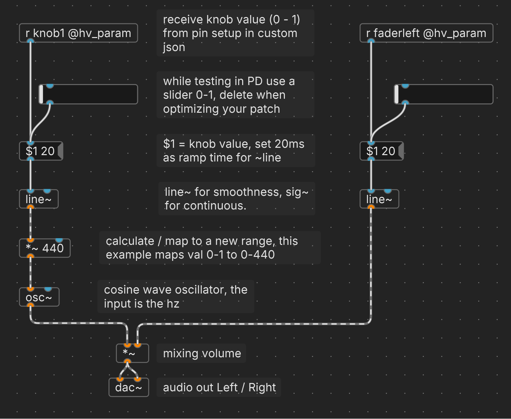

<details open markdown="block">
  <summary>
    Table of contents
  </summary>
  {: .text-delta }
1. TOC
{:toc}
</details>

{: .highlight}
> This is how far I've gotten in the content of this site, so what follows is a draft.

# Potentiometers - knobs and faders

A potentiometer is a three-terminal resistor with a sliding or rotating contact that forms an adjustable voltage divider. If only two terminals are used, one end and the wiper, it acts as a variable resistor or rheostat.

It's a knob or a slide fader that gives values between 0.0 and 1.0

## Name

There are different types of potentiometers, but in this context we will focus on two common ones: **single turn knobs** and **slide faders**. They are both linear, which means that the output voltage changes proportionally to the position of the contact.

> ### Single turn knobs
> These are potentiometers that you can rotate (almost) 360 degrees. They look like dials or knobs that you can turn clockwise or counterclockwise.
>
> They are linear, with a fixed range. And the knob types are therefore referred to as *single turn* - to differentiate clearly with the similar looking yet endless turning encoder.

> ### Slide faders
>
> These are potentiometers that you can slide up and down. They also have a fixed range. They look like sliders or levers that you can move along a track.

> {: .highlight}
> Technically they are the same. 

So most commonly these would be the attributes you're looking for in a potentiometer: 
- single turn, linear , 10k resistance.

For faders:
- slide potentiometer, linear, 10k resistance

## Function - what can it do

Potentiometers, or knobs and faders are a way to change values from one end to another.

While the potentiometer itself is read by the hardware in steps of 0 to 1023, it gets translated to a float value from 0 to 1.

{: .note}
|Type|_variant|Behavior|
|:----|:----|:----|
|Inputs|---|---|
|Voltage Input|---|Returns a floating point representation of the voltage at its input. The typical range is 0-5 V, which is represented as 0-1|

In Plugdata you will be using 0 to 1 as the float values to control things. When needed you do simple maths, e.g. if you would need a value range of 0 to 127, you'd add a block `* 100`. 

(Comparable to the mapping function with Arduino's.)

## What it looks like

> TODO: insert pictures/gif

### Potentiometers

> TODO: insert pictures/gif

### Slider/fader

> TODO: insert pictures/gif

## Pins

These are analog components, by changing the position of the knob or fader you change the amount of voltage they allow to flow. 

Hence, we need the analog pins on our boards. these are labeled as A0 to A11, these pins could be used for other things as well, so in the custom json we'll have to instruct to use them as `AnalogControl`

Connect the outer pins to power and ground, connect the middle pin to an Analog pin.

Follow this [link to the spreadsheet](https://docs.google.com/spreadsheets/d/1xtg_s1tk8tm-6qNkBLFc6V1L_Mpmu-PCOvv7qEyr9mU/edit?usp=sharing) showing the pin numbers used on/in the Daisy board, Plugdata, Synthux, ...

|Daisy seed pin numbers on the board|Daisy pin names digital|Daisy pin names analog|GPIO column middle|GPIO column outer L and R on the datasheet|Pin numbers on the Simple PCB microcontroller slot - corresponding to the row below the matrix|Pin names in synthux Analog and Digital simple-daisy.h|Pin names in synthux Mounted on the back AnalogOnTheBack and DigitalOnTheBack simple-daisy.h|Pin names in synthux simple-daisy-touch.h AND on the Touch PCB|Pin numbers for use in Plugdata custom json file |
|:----|:----|:----|:----|:----|:----|:----|:----|:----|:----|
|20|A GND|A GND|A GND|A GND|20| | |A GND| |
|21|3V3 Analog|3V3 Analog|3V3 Analog|3V3 Analog|29| | |3V3 Analog| |
|22|D15|A0|ADC 0| |30|S30|S19|S30|15|
|23|D16|A1|ADC 1| |31|S31|S18|S31|16|
|24|D17|A2|ADC 2| |32|S32|S17|S32|17|
|25|D18|A3|ADC 3| |33|S33|S16|S33|18|
|26|D19|A4|ADC 4| |34|S34|S15|S34|19|
|27|D20|A5|ADC 5| |35|S35|S14|S35|20|
|28|D21|A6|ADC 6| |36|S36|S13|S36|21|
|29|D22|A7|DAC OUT 2|ADC 7|37|S37|S12|S37|22|
|30|D23|A8|DAC OUT 1|ADC 8|38|S38|S11| |23|
|31|D24|A9|SAI2 MCLK|ADC 9|39|S39|S10| |24|
|32|D25|A10|SAI2 SD B|ADC 10|40|S40|S09| |25|
|35|D28|A11|SAI2 SCK|ADC 11|43|S43|S06| |28|
|38|3V3 Digital|3V3 Digital|3V3 Digital|3V3 Digital|46| | |3V3 Digital| |
|39|VIN|VIN|VIN|VIN|47| | |VIN| |
|40|D GND|D GND|D GND|D GND|48| | |D GND| |


## Components json 

`knob1` and `faderleft` in this example are the custom names you can choose, they are the names you'll use in Plugdata.

```json
    "components": {
        "knob1": {
            "component": "AnalogControl",
            "pin": 15
        },
        "faderleft": {
            "component": "AnalogControl",
            "pin": 16
        }
    }    
```

In plugdata we receive the values via a block with this text: `r knob1 @hv_param`

## PD example(s)

In this example we connect knob1 to the frequency of an oscillator, and a fader controls the volume.




- `r knob1 @hv_param` and `r faderleft @hv_param` receive knob and fader values (0 - 1) from the analog pins you setup in the custom json

- `hsl` horizontal slider: note that while for smaller patches it's not that important, but since this isn't used in actual hardware, it's good practice to keep it out of e.g. subpatches as it will take up some memory. Having many of these could add up.

- `$1` is a placeholder for the value received from the input, the second number will be taken by `line` as the time ramp in ms.

- The `line`-object is a linear ramp, it receives the two numbers as follows: 
  - the first part `$1`, is the value that it will output;
  - the second `20` is the time in milliseconds it takes to move to the next value, hence smoothing.

### Smoothing and the signal~ domain

#### Smooth:
At default setting you "read" the knob every 1ms, this could potentially introduce glitchy behavior if you send numbers every cycle, that's why we want to smooth out any small fluctuations from turning your crappy dusty knob.

Making this time too long might make it feel lagging, but in some cases could be preferable to get even smoother / slower / gradual changes.

#### ~Signal
Use `line~`, with the `~` to keep your patch as much as possible in this continuous signal domain. 

### Download this patch:
[potentiometer_fader_analogcontrol.pd](potentiometer_fader_analogcontrol.pd)

Or copy this text and paste it in a Plugdata patch (it should get "transformed" into what you see in the screenshot above):

```
#X obj 282 119 r knob1 @hv_param;
#X msg 282 247 \$1 20;
#X obj 282 299 line~;
#X obj 282 352 *~ 440;
#X obj 282 405 osc~;
#X obj 379 503 dac~;
#X obj 387 466 *~;
#X msg 651 247 \$1 20;
#X obj 651 299 line~;
#X obj 651 119 r faderleft @hv_param;
#X text 431 465 mixing volume;
#X text 369 343 calculate / map to a new range \, this example maps val 0-1 to 0-440, f 34;
#X text 431 502 audio out Left / Right;
#X obj 306 185 hsl 102 21 0 1 0 0 empty empty empty -2 -8 0 10 #191919 #e1e1e1 #e1e1e1 0 1;
#X obj 691 185 hsl 102 21 0 1 0 0 empty empty empty -2 -8 0 10 #191919 #e1e1e1 #e1e1e1 0 1;
#X text 431 170 while testing in PD use a slider 0-1 \, delete when optimizing your patch, f 24;
#X text 431 103 receive knob value (0 - 1) from pin setup in custom json, f 24;
#X text 431 238 \$1 = knob value \, set 20ms as ramp time for ~line, f 24;
#X text 433 290 line~ for smoothness \, sig~ for continuous., f 24;
#X text 367 396 cosine wave oscillator \, the input is the hz, f 24;
#X connect 0 0 1 0 32.................s.........PK.........jE....;
#X connect 1 0 2 0 32.................E.........PA.........n.....;
#X connect 2 0 3 0 32.................O.........vC.........3A....;
#X connect 3 0 4 0 32.................P..........D.........7A....;
#X connect 4 0 6 0 32.................S....jF...vD....oA...jB....;
#X connect 6 0 5 0;
#X connect 6 0 5 1;
#X connect 7 0 8 0 32.................E.........PA.........n.....;
#X connect 8 0 6 1 32.................9A...Pv+++ue....D7+++6H....;
#X connect 9 0 7 0 32.................s.........PK.........jE....;
#X connect 13 0 1 0;
#X connect 14 0 7 0;

```
## links / references / sources

TODO:
- link to parts on e.g. Thonk
- link to synthux docs/vids

***


