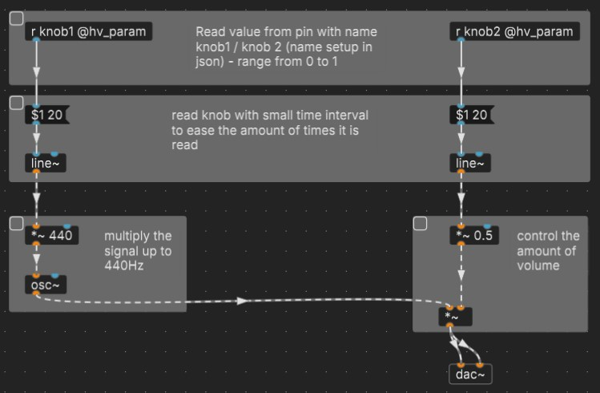

  

    Table of contents
  

  {: .text-delta }
1. TOC
{:toc}

{: .highlight}
> This is how far I've gotten in the content of this site, so what follows is a draft.

# Potentiometers - knobs and faders

A potentiometer is a three-terminal resistor with a sliding or rotating contact that forms an adjustable voltage divider. If only two terminals are used, one end and the wiper, it acts as a variable resistor or rheostat.

It's a knob or a slide fader that gives values between 0.0 and 1.0

## Name

There are different types of potentiometers, but in this context we will focus on two common ones: single turn knobs and slide faders. They are both linear, which means that the output voltage changes proportionally to the position of the contact.

> ### Single turn knobs
> These are potentiometers that you can rotate (almost) 360 degrees. They look like dials or knobs that you can turn clockwise or counterclockwise.
>
> They are linear, with a fixed range. And the knob types are therefore referred to as *single turn* - to differentiate clearly with the similar looking yet endless turning encoder.

> ### Slide faders
>
> These are potentiometers that you can slide up and down. They also have a fixed range. They look like sliders or levers that you can move along a track.

> {: .highlight}
> Technically they are the same. 

So most commonly these would be the attributes you're looking for in a potentiometer: 
- single turn, linear , 10k resistance.

For faders:
- slide potentiometer, linear, 10k resistance

## Function - what can it do

Potentiometers, or knobs and faders are a way to change a values from one end to another.
While the potentiometer itself is read by the hardware in steps of 0 to 

## What it looks like

## Pins

## Components json 

## PD example(s)

[potentiometer_2knobs_pitch_volume.pd](potentiometer_2knobs_pitch_volume.pd)

## links / references / sources

***

Template structure for parts:
  1. Name
  2. function - what can it do
  3. what it looks like
  4. Pins
  5. Components json 
  6. PD example(s)
  7. links / references / sources