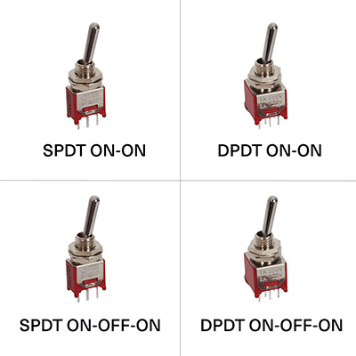

<details open markdown="block">
  <summary>
    Table of contents
  </summary>
  {: .text-delta }
1. TOC
{:toc}
</details>

{: .warning }
> 👀 This page is in draft mode and might contain double or lacking info ...

# Toggle switches and buttons


<sub>Whether the switch is the shape of a toggle, or a simple pushbutton, in our code they are both called switches.</sub>

## Name

Button, switch, toggle switch,  they all refer to the same principle of having one connection and changing its state.

In stores you'll find hundreds of types and names.

A good idea to start is with the terms ON-OFF and then see which configuration fits your needs.

## function - what can it do

The simplest we can think of is a button you push. Like those on a keyboard. You can hold the button down, and when you release it it jumps back up.

There are more variants like the type of light switch buttons, you flick or push it in one position, another click releases it.

The on-off-on switches you'll find in the Synthux kits can be seen as two buttons in one. The middle position is 'neutral' flicking it either side will engage and keep pushing down on that knob.

In Plugdata we have a few ways to address the button or switch:
- Trigger or bang: It can react and do something as soon as you've pushed it;
- Press: you can press and hold it for a while to keep it active;
- or make it do something when you release it;
- or do different thing depending on how many seconds you're holding it.

In it's simplest way we push it and it sends a bang. In this example the push is connecting digital pin 8 to ground which triggers a bang:


<video width="720" height="auto" controls>
  <source src="img/plugdatadaisybutton_kick.mp4" type="video/mp4">
</video>

### Toggles

The SPDT ON-ON and ON-OFF-ON LOOK the same, have the same 3 pins. But the mechanical difference is that one flips from left to right, and the other also stops in the middle.

ON - ON will send either the left or right pin as 'active'.

ON - OFF - ON Does the same, however it's middle position is disconnected from either side.

In Plugdata we can use the info of releasing a button or toggle as well.

That means while the ON-OFF-ON toggle is only connected to two pins, we can use it to toggle between 3 states or 3 different functions. E.g. 3 octaves, 3 wave forms, ...

### Learning to print to serial for debugging

{: .highlight}
> For debugging purposes, or just learning what positions or messages you're sending by moving or pushing the button/switch, it can be handy or necessary to learn how to print to serial.

<details open markdown="block">
  <summary>
    Printing to serial instructions</summary>
To be able to read messages sent by our components we can send it to print. Like with an Arduino this would be the function `Serial.print()`.

Steps to follow:

- In Plugdata you connect your component to a print object.
- When compiling you activate the serial debugging via USB
- connect to a serial monitor
  - If you have already setup Arduino you can use it's serial monitor.
[More info at its own page.](https://jonwaterschoot.github.io/plugdata-daisy-simple/01_install_setup_plugdata/04_serial/serial_debug_print.html)

- It's always best to remove print objects (and other gui objects like sliders) that are not used in the final patch as these cost memory/performance.

</details>

## What it looks like

<video width="320" height="auto" controls>
  <source src="img/toggleswitchesSynthuxSimplTouch3sounds.mp4" type="video/mp4">
</video>

[Toggle switches Synthux Simple Touch 3 sounds short video demo](img/toggleswitchesSynthuxSimplTouch3sounds.mp4)

For Plugdata or Daisy, the type of button or toggle doesn't matter. We just need to now what signal they send in which position.

The toggle switches one that are in the Synthux kits look like the red ones in the picture above.

There are also slider toggle types, rocker types, like the light switch on your walls, there are push button versions that remain in position when clicked and released when clicked again. There are momentary buttons, there those with built in LED's. It's endless.

You'll want to verify the datasheet of the parts to learn what type it is. Often by just looking at the part it may not be obvious.

Some toggles will just be a way of breaking or connecting one wire.


<sub>image from [Thonk shop](https://www.thonk.co.uk/shop/sub-mini-toggle-switches/)</sub>


## Pins

For a simple pushbutton you want the one end of your button in a digital pin, the other connected to ground.


<sub>Here one end of the button is connected, not soldered yet, to pin 8, the other into the ground connection  in the `P` of the Simple logo (the round pin in the `S` is 3.3V)</sub>

Both the ON-ON and the ON-OFF-ON Toggle switches have 3 pins.

- Both the outer pins should connect to a digital pin on the Daisy.
- The middle pin connects to ground

Don't forget there are two GND points on the Daisy that you should connect outside the board. In Synthux Simple Touch, and the Simple Fix, this is done on the PCB itself by soldering the bridges. On the larger Simple board this is done via a short wire on the left side of the board. If in doubt do check in the manual/guide. 

For the available digital pins do check which ones are still free. Some pins can have multiple ways to use them, that's why they are defined accordingly in the json file.

[Link to table overview Daisy Seed pins and Synthux Simple boards.](https://docs.google.com/spreadsheets/d/1xtg_s1tk8tm-6qNkBLFc6V1L_Mpmu-PCOvv7qEyr9mU/edit?usp=sharing)

In Plugdata you can refer to these pins with the added `_press`, `_fall` and `_seconds` (see examples below)

|Switch|---|Returns a bang on the signal's rising edge (i.e. when the switch is actuated).|
|:----|:----|:----|
|Switch|_press|Returns a float representing the current state (1 = pressed, 0 = not pressed)|
|Switch|_fall|Returns a bang on the signal's falling edge (i.e. when the switch is released).|
|Switch|_seconds|Returns a float representing the number of seconds the switch has been held down.|


## Components json

We refer to the buttons/toggle switches as `Switch` and define the digital pins we connected to. 

In the kickdrum example there's one volume knob and one pushbutton:

```json
{
    "name": "Simplebutton",
    "som": "seed",
    "defines": {
        "OOPSY_TARGET_HAS_MIDI_INPUT": 1
    },
    "audio": {
        "channels": 2
    },
    "components": {
        "knob1": {
            "component": "AnalogControl",
            "pin": 15
        },       
       "button01": {
           "component": "Switch",
           "pin": 7
       }
    }
}
```

[Download the above kickdrum json](button-switch.json)

---

This example has 1 potentiometer and 4 pins set as switches.


```json
{
    "name": "Simple",
    "som": "seed",
    "defines": {
        "OOPSY_TARGET_HAS_MIDI_INPUT": 1
    },
    "audio": {
        "channels": 2
    },
    "components": {
        "knob1": {
            "component": "AnalogControl",
            "pin": 15
        },
        "toggle1left": {
           "component": "Switch",
           "pin": 8
       },
       "toggle1right": {
           "component": "Switch",
           "pin": 9
       },
       "toggle2up": {
           "component": "Switch",
           "pin": 7
       },
       "toggle2down": {
           "component": "Switch",
           "pin": 6
       }
    }
}
```
[Download the above toggle example json](on-off-on_switch-3options.json)


## PD example(s)

### Trigger a kickdrum with a button; bang

When you do not add anything to `r button1 @hv_param` it will send a bang when actuated.
As shown on the top, here's a simple kick, the button and the slider in this patch are only there to test your patch inside of Plugdata, for your final project you can erase those.


Here the trigger actuates the kickdrum from [Mike Moreno's Simple Drum Machine](https://www.youtube.com/watch?v=nxnCkns-zMo), the knob acts as a volume control.


### Switch: hold with `_press`

todo

### Switch seconds

todo

### Switch release

todo

***

### ON OFF ON - 3 options examples

Even though our toggles has only two connected pins, we can emulate the third by using the zero position. We trigger an action by looking for when we de-activate the toggle. So by defining "position 1 and position 2 are not active anymore" we activate option 3.

Add `_fall` to the custom switch pin name, e.g. `toggle1left` + `_fall` you write `r toggle1left_fall @hv_param` in a Plugdata object.

We can also do this for the `_press` action. See the above table to know which message they send. Or use a print object to verify. ([about serial printing](/01_install_setup_plugdata/04_serial/serial_debug_print.md))

Below I've got two examples that work, though they might need optimizing.

#### Using the object `[spigot]`


Download this pd example: [on_off_on_switch-3options_spigot.pd](on_off_on_switch-3options_spigot.pd)

#### Using a signal flow


Download this pd example: [on_off_on_switch-3options_signal.pd](on_off_on_switch-3options_signal.pd)


## links / references / sources


