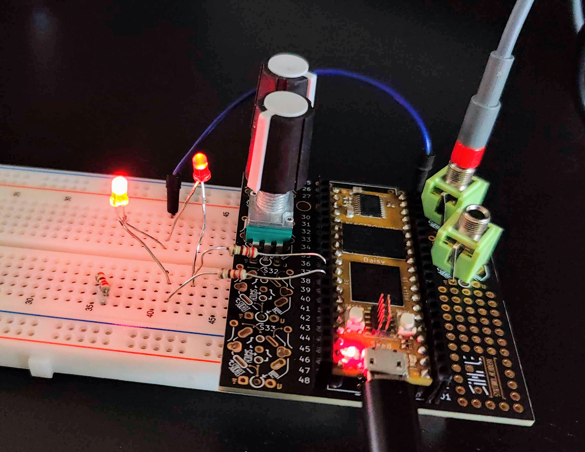

# LED's - light emitting diodes

The little lights that can enhance the user experience; or just brighten the day.

## function - what can it do

A type of diode that illuminates when you pass power through it. The electricity will only flow in one direction. Take a small 3.3V coin cell and attach the LED, flip it around and you'll see this: one way it works, the other way round it doesn't.


|LED|---|Expects a floating point value from 0-1. The brightness is PWM modulated to match the input.|
|:----|:----|:----|
|RGB LED|---|Expects a floating point value from 0-1. The default behavior sets all three colors to the same brightness.|
|RGB LED|_white|Same as default.|
|RGB LED|_red|Expects a floating point value from 0-1. Sets the brightness of the red LED only.|
|RGB LED|_green|Expects a floating point value from 0-1. Sets the brightness of the green LED only.|
|RGB LED|_blue|Expects a floating point value from 0-1. Sets the brightness of the blue LED only.|

### To fade or not to fade.

Simplest thing is to just turn the LED on or off. However it's also possible to use fading or making the led's less bright.

To fully understand this you could dive deep in how LED's work or you could look up the history of developing the infamous blue LED, but lets keep it at the basics here.

After you've connected the LED (see pins - section below), you'll program the LED to get powered On or Off, do this fast enough and you could create the illusion of fading.

### Fading - PWM

To create a difference in brightness ideally you control the amount of electricity that flows through it. So less voltage would result in less brightness.
If a pin like on many micro-controllers can only output a steady 3V or 5V, there is a way to still achieve this, called ***Pulse Wave Modulation (PWM)***. By quickly turning the led on and off, faster than the human eye can see, we can create the 'illusion' of more or less brightness.

For Plugdata this means that when we've setup the hardware and custom json file to use the PWM approach we can simply send a value between 0 and 1 to achieve brightness. Animate this change and we'll achieve fading.

***

## What it looks like


<sub>from [Wikipedia By Inductiveload](https://en.wikipedia.org/wiki/Light-emitting_diode#/media/File:LED,_5mm,_green_(en).svg) - Own work by uploader, drawn in Solid Edge and Inkscape.</sub>

### One color LED

A one color LED has two legs, an anode and a cathode.

The longer leg is usually the anode connecting to power, the shorter leg the cathode and will connect to ground.

### RGB LED

RGB LED's have four legs, one for each color and one pin.


<sub>An RGB led projecting it's 3 colors Red Green and Blue - From [Wikipedia By Viferico](https://en.wikipedia.org/wiki/Light-emitting_diode#/media/File:RGB-Led-projection.jpg) - Own work, CC BY-SA 4.0</sub>

I think you'll mostly come across the common cathode RGB LED, however search for "RGB LED Common Cathode versus Common Anode" and you'll find many confused souls.

For the common cathode RGB LED you need to wire up each R, G, B, pin with a resistor to a pin on the microcontroller, the common ground goes straight to ground. So take in mind that an RGB LED will 'cost' you 3 pins.

### Expanding the number of controllable PWM pins

Using an extra chip, e.g. PCA9685, like done on some of the Electro-Smith devices (Patch, Petal), is probably the best way if you're in need of more pins or LED's.
There is a breakout board by Adafruit that connects over i2c, however, I've not tried hooking this up myself, so can't provide full guidance. [Look at the json files of json2daisy](https://github.com/electro-smith/json2daisy/tree/f77c6b40b95372643616dbef445e760998aacf33/src/json2daisy/resources), e.g. the main component_defs.json and the board specific json files for The Patch and PPetal, you'll find the code used for those. Look for words LED and the chip PCA9685.

***

## Pins - wiring up the LED's

For the sake of demoing, we'll be using single color LED's. These have a shorter leg, the cathode that needs to be connected to ground and the longer leg that goes through a resistor, 22O ohm, into the Daisy GPIO pins.

Due to reasons not fully cleared up yet (i thinking something with samplerate) these are some starting things to know:

- In the json2daisy main components_defs.json file you can see that the LED is set standard to be inverse.
  - This seems counterintuitive as most commonly led's are connected with their anode to be controlled by pwm with a GPIO pin and the cathode being connected to ground. 
  - sending a `1` to the LED will therefore make it go "off"

- When using fading there can be a jitter or stepped result depending on which way you connect the LED
  - Setting the LED in the custom json board file with `"invert": "false"` will reverse the on / off direction, but also this jitter / stepped fading

Here are the results of my tests:  

|LED connection --> |anode to 3v3, cathode to pin D24|anode to pin D25, cathode to ground|
|:----|:----|:----|
|Fading with metro - line~ + normal json|jitter / stepped|smooth|
|Fading with metro + line~ + json set to `"invert": "false"` |smooth|jitter / stepped|
|Sending "1" to LED +  normal json|LED = ON|LED = OFF|
|Sending "1" to LED + json set to `"invert": "false"` |LED = OFF|LED = ON|

This video demonstrates the led flicker / stepped behavior:


{: .new}
> Todo / to check: Which pins can do PWM? Thus far I've used the Analog pins, yet defining them in the custom json as led's sets them up as pwm pins, so as per some info I understand that any pin can be setup as pwm because it's software pwm, hardware pwm is still under development. Source: [Takumi Ogata on Daisy forum](https://forum.electro-smith.com/t/dimming-leds-with-hardware-pwm/4957/3) and: [Led Class reference on libDaisy](https://electro-smith.github.io/libDaisy/classdaisy_1_1_led.html#details)

***

## Components custom json

Depending on how you've wired the pins you might find it easy to define the invert to false.
However, you could also just use simple math by passing the signal through `[* -1] - [+ 1]` and hence sending the inverted value.

When you do not add the invert false line and connect the led with its ground side, the cathode to the PWM pin, the led will be off when receiving a 1.

This is the way to address the pins in json, note the invert line.

```json
       "led1": {
        "component": "Led",
        "pin": 23
       },
       "led2": {
            "component": "Led",
            "pin": 24,
            "invert": "false"
```

***

## PD example(s)

In the following examples, some might become confusing as these were the patches I made while testing the various ways to connect and manipulate the inversion of values.

In the patches were I added a green canvas, that's the indication that the code is doing what you likely want, going from off to on.

### PD example: Simple on / off by sending 0 or 1

Sending `[O]` (zero), 


<sub>Turning the led on / off</sub>

(note the added messages 1 or 0 depending on the use of invert in the custom json.)

[Download this patch `ledtest_on_send_0`](ledtest_on_send_0.pd)

### PD example: 2 Fading with a knob

Using a potentiometer (knob or fader) to change the led value.


### PD example: Setting brightness

In this example we do not use `"invert": "false"` in the custom json, we invert the values in Plugdata with `[* -1] - [+ 1]`. The LED's are wired with there anodes through 220ohm resistors into pins D24 and D25. (one resistor per LED)

```json
       "led2": {
            "component": "Led",
            "pin": 24
       },
       "led3": {
            "component": "Led",
            "pin": 25
```

Your milage may vary, but in finding the exact values, I found that only the first 10% offer a substantial difference. You might have to play around with brightness values, certainly when you want e.g. Off, bright, brighter, on. I find it difficult to distinguish between most in between values, so I'd stick to on, dimmed, off.

The sweet spot value for my example was `0.2`.



Plugdata patch:


[Download this patch `ledtest_brightness.pd`](ledtest_brightness.pd)

### PD example: Fading using metro + Toggle + Line~

Using metro with a toggle we send a 1 or a 0 after each bang that the tgl sends


<sub>Fading with metro and line~</sub>

[Download this patch `ledtest_fading_metro`](ledtest_fading_metro.pd)

### PD example: Fading following another value 1

In this example we want the LED to be on when the touchpad is toggled on. Depending on your pin setup this might need a simple reversing of the 0 to 1 value.

This patch is using the touch sensor mpr121, to get that sensor running, you need to do some extra stuff, see the page 'custom json board' ([link](01_install_setup_plugdata\03_custom_json_board\03_custom_json_board.html)) for more info.
You could simply use e.g. a button/switch instead.


<sub>Fading volume and led brightness with line~</sub>

[Download this patch `ledtest_fading_reversed_mpr121.pd`](ledtest_fading_reversed_mpr121.pd)

### PD example: Fading following another value 2

In this example one potentiometer controls the frequency of an osc~, the volume and there's an led that follows the value.

Again, depending on the way you wired cathode / anode and wether you define `"invert": "false"` you might need to adjust the value direction.

Note there's rather a lot of needless extra complexity due to the testing, I hope that you get the basic principles.


[Download this patch `ledtest_fading-osc-vol-led`](ledtest_fading-osc-vol-led.pd)

***

{: .new}
> After all of my testing, I've come to the decision to leave invert out of the custom json, and reverse the value in Plugdata when needed.
> Depending on what LED's and how you have wired them up, you might want to define the desired values on `loadbang` as well. E.g. if your patch/synth boots and turns the led on, and only updates after you use it the first time.

***

## Links / references / sources

  - https://github.com/electro-smith/json2daisy/blob/f77c6b40b95372643616dbef445e760998aacf33/src/json2daisy/resources/component_defs.json#L179

  - https://electro-smith.github.io/libDaisy/classdaisy_1_1_led.html
  
  - https://electro-smith.github.io/libDaisy/led_8h_source.html

  Forum posts:

  - https://forum.electro-smith.com/t/issue-getting-led-to-work-with-gpio-pin/4078
  
  - https://forum.electro-smith.com/t/repurpose-seed-pins/1111
  
  - https://forum.electro-smith.com/t/dimming-leds-with-hardware-pwm/4957/3

  Discord Thread on Daisy server: about LED's + Daisy + Plugdata

  - [Thread in the channel #puredata "LED's and Daisy's"](https://discord.com/channels/1037767234803740694/1209141293003841578)

***

## Addendum - testing with Arduino

To ensure the flickering/ stepped behaviour was caused by software or hardware I tried some cpp code.

I've tested the difference between Plugdata and using Arduino to fade the leds, and must conclude that the flickering is caused somewhere along the 'software' side.
Note in the video I just shot the Synthux Simple Fix has the two different wirings, while the Simple Touch has already been re-soldered with the anodes into pins 24 and 25.

the current setup:

LED1:
Anode (longer lead) connected to 3.3V.
Cathode (shorter lead) connected to pin 24.

LED2:
Anode (longer lead) connected to pin 25.
Cathode (shorter lead) connected to a common ground pin.

To achieve synchronized fading, we'll use PWM (pulse-width modulation) to control both LEDs. Since LED1 has its anode connected to 3.3V, we'll use inverse PWM for LED1 (i.e., writing 255 will turn it off, and writing 0 will give it full brightness). For LED2, we'll use regular PWM.
Below is the updated code that should synchronize the fading of both LEDs:

```cpp
// Pin connected to LED1's cathode (common ground)
const int ledPin1 = 24;
// Pin connected to LED2's anode
const int ledPin2 = 25;

// Total duration for fading (in milliseconds)
const int totalDuration = 4000;

// Duration for fading in (in milliseconds)
const int fadeInDuration = 2000;

// Calculate the step size for fading
const float fadeStep = 255.0 / (fadeInDuration / 10); // Divide by 10 for smoother fading

void setup() {
  pinMode(ledPin1, OUTPUT);
  pinMode(ledPin2, OUTPUT);
}

void loop() {
  // Fading in both LEDs simultaneously
  for (int brightness = 0; brightness <= 255; brightness += fadeStep) {
    analogWrite(ledPin1, 255 - brightness); // Inverse PWM for LED1
    analogWrite(ledPin2, brightness);
    delay(10); // Small delay for smoother fading
  }

  // Fading out both LEDs simultaneously
  for (int brightness = 255; brightness >= 0; brightness -= fadeStep) {
    analogWrite(ledPin1, 255 - brightness); // Inverse PWM for LED1
    analogWrite(ledPin2, brightness);
    delay(10); // Small delay for smoother fading
  }
}
```
This code should ensure that both LEDs fade in and out together, creating a synchronized effect. Adjust the timing and duration as needed to achieve the desired visual effect. 🌟

<video width="auto" height="auto" controls>
  <source src="img/cpp_testingfadingflickeringLEDs.mp4" type="video/mp4">
</video>

Thus far the conclusion appears to be that this is related to the speed at which the PWM updates.
Libdaisy has mention of the fact that hardware pwm is still being worked on. So all this might become different in the future (today = March 2024)

***