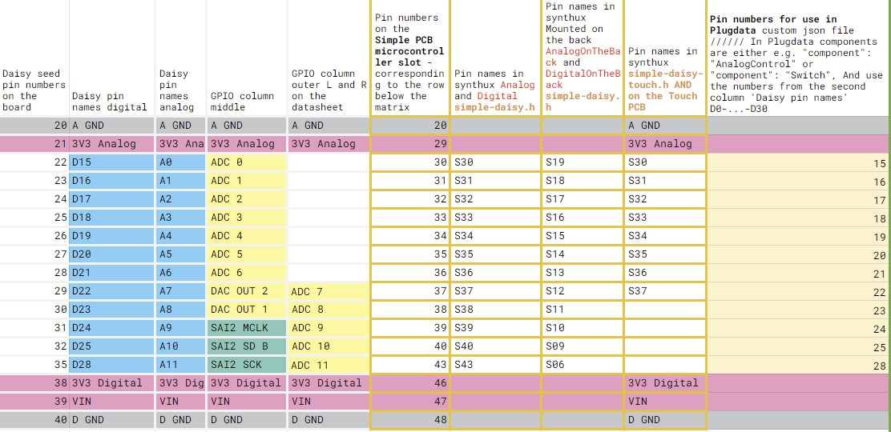

  

    Table of contents
  

  {: .text-delta }
1. TOC
{:toc}

# Control Voltage - CV

How Daisy can send or receive CV signals over some of it's pins.

{: .attention }
> 👀 This page is still in draft mode.

>Example for the json file: https://github.com/electro-smith/json2daisy/blob/main/src/json2daisy/resources/patch_init.json
>
>You can send values between 0 and 1 to those send objects.
>
>[s cvout1 @hv_param]
>
>you need regular control messages
>
>the cv i/o in Daisy are all running at control rate. so they evaluate once every audio block (every 1ms at default settings)

From Daisy forum, an [answer by Takumi Ogata](https://forum.electro-smith.com/t/is-there-a-resource-for-how-to-use-json-pin-names-when-using-pd2dsy/4005/6):

{: .note }
> The Daisy Seed outputs 0.0V-3.3V out of its DAC outputs. And on boards like the Daisy Patch, that signal is amplified to 0.0V-5.0V.
>
> The Daisy (unlike Arduino) has GPIO pins. So pin D20 can be analog input or even digital output. Also worth noting that, even if you decided to use pin D20 as analog A5, it doesn’t care if you’re using an analog component like potentiometer or digital component like a switch as long as the voltage coming in is 0.0V to 3.3V range.
>
> Cd4051 Multiplexer Tutorial Is Here! 6
>
> If you’re using DaisyDuino or .cpp, it’ll be easy: [Let's Add 4+ More DACs/CVs with Quad DAC! (Also, I2C tips!)](https://forum.electro-smith.com/t/lets-add-4-more-dacs-cvs-with-quad-dac-also-i2c-tips/3428)
For pd2dsy and Oopsy, I haven’t looked too deep into it.
> In general, a component like the MCP4922 is recommend for adding more DACs.

***
## Name

### Control Voltage - CV

**CV/gate (an abbreviation of control voltage/gate)** is an analog method of controlling synthesizers, drum machines, and similar equipment with external sequencers. The control voltage typically controls pitch and the gate signal controls note on-off.

> The Daisy Seed outputs 0.0V-3.3V out of its DAC outputs. And on boards like the Daisy Patch, that signal is amplified to 0.0V-5.0V.

## function - what can it do

Unlike the midi format, CV is a protocol of communicating with variable Voltages. It is an analog way of sending or receiving a value.

It is often used on desktop synths to allow communicating with other synths or Eurorack systems.

## what it looks like

Generally CV is transferred via a TS, mono patch cable, in the 3.5mm jack format.

## Pins

Eurorack and CV signals vary in the range they operate in, on some devices you can setup what this range is. Typical ranges are –5 V to 5 V, 0 V to 5 V, 0 V to 10 V ...

> The Daisy Seed outputs 0.0V-3.3V out of its DAC outputs. And on boards like the Daisy Patch, that signal is amplified to 0.0V-5.0V.
>
> The Daisy (unlike Arduino) has GPIO pins. So pin D20 can be analog input or even digital output. Also worth noting that, even if you decided to use pin D20 as analog A5, it doesn’t care if you’re using an analog component like potentiometer or digital component like a switch as long as the voltage coming in is 0.0V to 3.3V range.

ADC: all Analog labeled pins: D15 to D25 and D28
DAC OUT: Only pins D22 and D23

For arduino / cpp Takumi Ogata posted this: [Let’s Add 4+ More DACs/CVs with Quad DAC! (Also, I2C tips!)](https://forum.electro-smith.com/t/lets-add-4-more-dacs-cvs-with-quad-dac-also-i2c-tips/3428)

GPIO overview table of the analog ADC DAC pins:

[Full link to the spreadsheet](https://docs.google.com/spreadsheets/d/1xtg_s1tk8tm-6qNkBLFc6V1L_Mpmu-PCOvv7qEyr9mU/edit?usp=sharing) 

## Components json

Example for the json file:

https://github.com/electro-smith/json2daisy/blob/main/src/json2daisy/resources/patch_init.json

## PD example(s)

...

## links / references / sources

[Example for the json file of Patch Init](https://github.com/electro-smith/json2daisy/blob/main/src/json2daisy/resources/patch_init.json)

Daisy forum, an [answer by Takumi Ogata](https://forum.electro-smith.com/t/is-there-a-resource-for-how-to-use-json-pin-names-when-using-pd2dsy/4005/6)

For arduino / cpp Takumi Ogata posted this: [Let’s Add 4+ More DACs/CVs with Quad DAC! (Also, I2C tips!)](https://forum.electro-smith.com/t/lets-add-4-more-dacs-cvs-with-quad-dac-also-i2c-tips/3428)

[Full link to the spreadsheet](https://docs.google.com/spreadsheets/d/1xtg_s1tk8tm-6qNkBLFc6V1L_Mpmu-PCOvv7qEyr9mU/edit?usp=sharing) 

