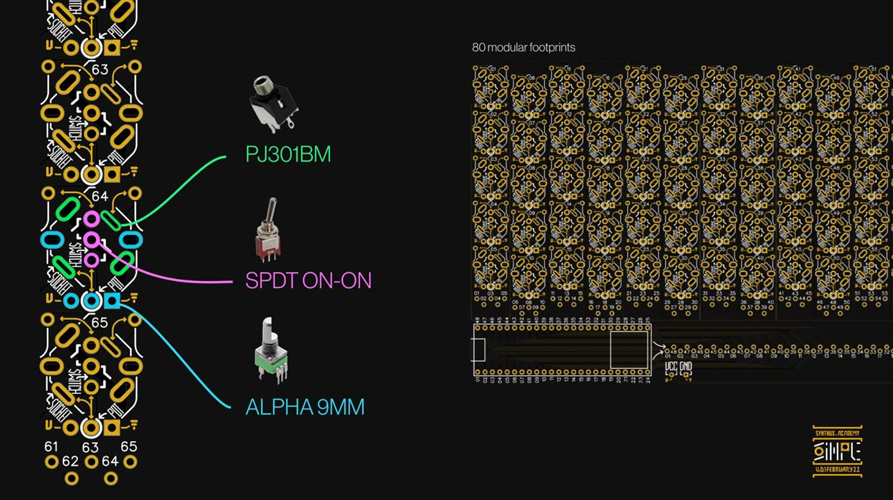

# Plugdata components examples

This folder contains the examples. Folders have been set up for all the planned parts, yet are incomplete. 
Some parts are more complex so the info won't be as easy to illustrate for me.

Picture from the Synthux website

{: .highlight }
> 💡 To do - link README for Github in this folder